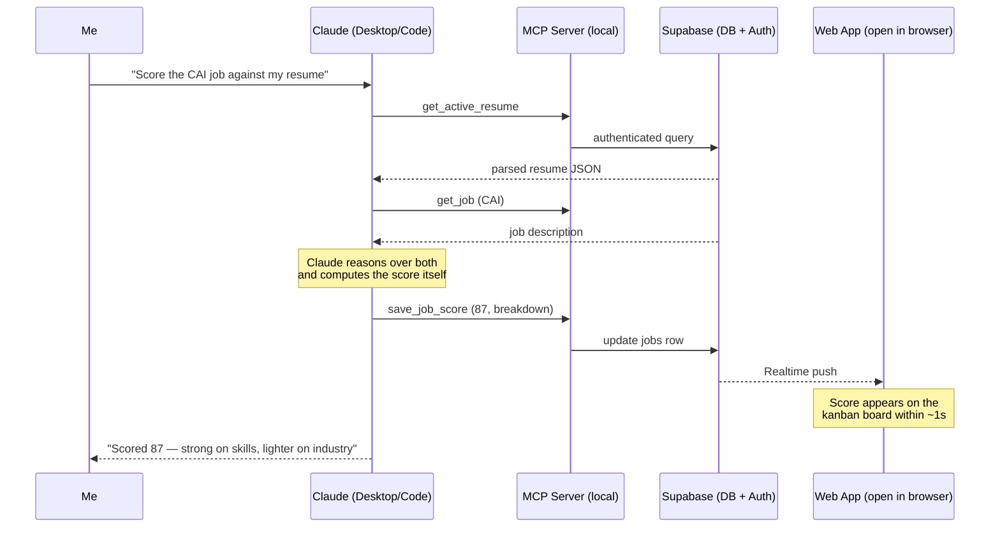
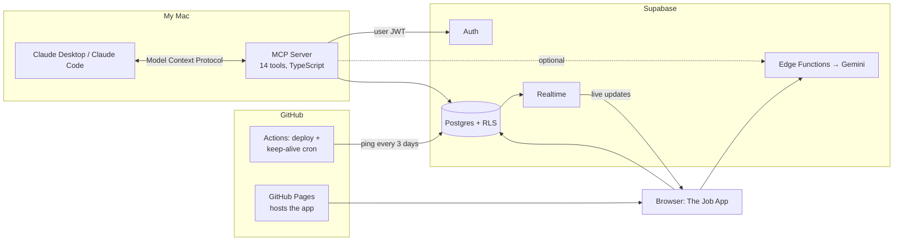

# How It All Works — The Job App + Claude

*A business-friendly walkthrough of the architecture, written to be spoken aloud.*

## The one-sentence version

I built a job-search web app, then connected Claude to it as an AI assistant that can read and update the app through natural conversation — so I can say *"I just applied to the Actionist role, move it on my board and draft a cover letter for the next one"* and watch it happen live on screen.

## The three layers

### 1. The app people see

A single-page web application (React + TypeScript) hosted for free on GitHub Pages. Users search live job listings, upload a resume, get an AI match score for every job (0–100, with a breakdown across skills, experience, keywords, seniority, and industry), and manage applications on a drag-and-drop kanban board — *Saved → Applied → Interviewing → Offer*.

### 2. The backend that does the work

Supabase — a managed backend platform — provides four services from one project:

- **Database** (Postgres) holding profiles, resumes, jobs, applications, and generated documents. Every table enforces *row-level security*: the database itself guarantees users can only ever touch their own rows, no matter what code is calling it. Security lives at the data layer, not sprinkled through app code.
- **Auth** — email/password accounts; every request carries a signed token identifying the user.
- **Realtime** — the app holds an open subscription to the database. When a row changes, the UI updates within a second, *no matter who or what changed it*. This one feature is what makes the Claude integration feel magical later.
- **Edge Functions** — small server-side programs that call the Gemini AI model for resume parsing, job scoring, and cover-letter drafting. The AI key lives only on the server; the browser never sees it.

### 3. The Claude integration (the part I'm proudest of)

**MCP — the Model Context Protocol — is an open standard for handing an AI assistant a set of typed, permission-scoped tools.** Think of it as writing a job description for an AI: here are the fourteen actions you may take, here's what each one needs, here's what it returns.

I wrote an MCP server (~400 lines of TypeScript) that gives Claude tools in three tiers:

| Tier | Examples | What it means |
|---|---|---|
| **Read** | `get_pipeline`, `get_active_resume` | Claude can see my board, saved jobs, and parsed resume |
| **Write** | `add_job`, `update_application` | Claude can add jobs and move cards through pipeline stages |
| **AI** | `save_job_score`, `save_cover_letter` | Claude scores jobs and writes cover letters itself, then saves the results into the app |

The server signs into Supabase with my own account credentials — so Claude operates under exactly the same row-level security rules as I do in the browser. It cannot see or touch anyone else's data, by construction.

## What a conversation actually looks like

The punchline for a demo: **the browser is open next to the chat, and the board updates by itself as Claude works.** No refresh, no integration glue in the frontend — the app can't even tell whether a human or Claude made the change, because both go through the same authenticated, security-checked path.

## Three design decisions worth talking about

**1. The AI cost inversion.** The app's built-in AI buttons call Gemini, which I pay for per-use. But when Claude drives the app, Claude *is* the AI — so instead of having tools that call a second AI, I gave Claude "save" tools and let it do the scoring and writing itself, in-session, covered by my existing Claude subscription. Same results land in the same database tables; marginal AI cost of the agentic workflow: zero. The Gemini path still exists for the app's own UI, where a subscription can't reach.

**2. Security by placement, not by policing.** Row-level security in the database means every actor — browser, Claude, future integrations — inherits the same guarantees automatically. The AI integration required *zero* new security code, because there was no privileged path to secure. The MCP server holds no elevated keys; it's just another logged-in user.

**3. Reliability automation for a zero-budget stack.** Free tiers idle out: Supabase pauses projects after a week of inactivity, and GitHub suspends scheduled jobs after 60 days without commits. A single scheduled GitHub Action solves both — it queries the database every three days (keeping Supabase awake) and, if the repo has been quiet for 45 days, pushes an empty heartbeat commit (keeping its own schedule alive). It's self-sustaining and emails me only when something actually breaks.

## What this demonstrates (the interview framing)

- **Working with AI as a builder, not just a user** — I used Claude Code to design and build the integration, and the artifact itself is infrastructure *for* AI: a tool interface that any MCP-compatible assistant can drive.
- **Systems thinking** — the interesting part isn't any single component; it's that Realtime + row-level security + MCP compose into "AI updates my app live, safely" with almost no new code.
- **Cost/benefit judgment** — recognizing that the agentic path made a second AI redundant, and restructuring the tools to exploit that.
- **Operational maturity** — secrets kept out of source control, dependency vulnerabilities scanned and patched, input sanitization on query filters, and failure paths that notify rather than fail silently.

## The full picture

