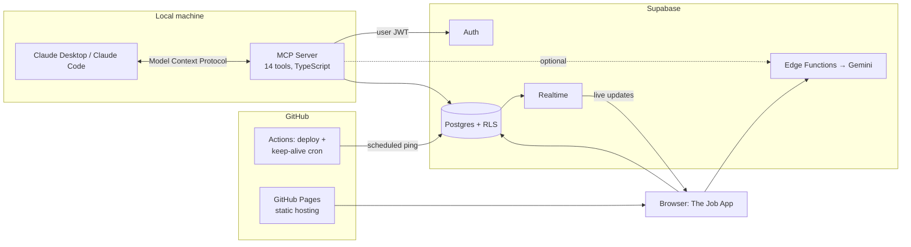
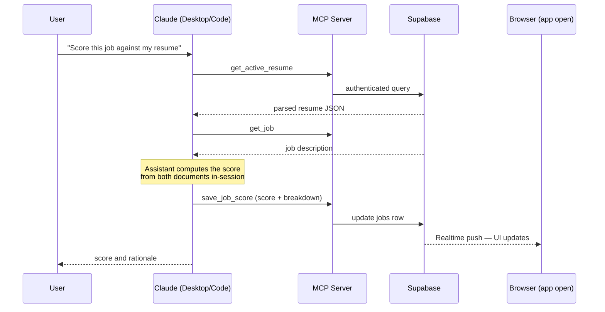

# Architecture

The Job App is an AI-powered job search and application tracker with a conversational control surface: in addition to the web UI, the application can be read and updated by an AI assistant (Claude) over the [Model Context Protocol](https://modelcontextprotocol.io), with changes appearing live in the browser.

## System overview



## Layers

### Frontend

A React 19 + TypeScript single-page application built with Vite and hosted on GitHub Pages. Users search live job listings (Adzuna), upload a resume, receive an AI match score per job (0–100 with a skills/experience/keywords/seniority/industry breakdown), and manage applications on a drag-and-drop kanban pipeline (*Saved → Applied → Interviewing → Offer*). Client state is held in a Zustand store.

### Backend

A single Supabase project provides four services:

- **Postgres with row-level security.** Tables: `profiles`, `resumes`, `jobs`, `applications`, `generated_docs`. RLS policies on every table restrict access to the row owner, so tenancy is enforced at the data layer rather than in application code.
- **Auth.** Email/password accounts; every request carries a signed JWT identifying the user.
- **Realtime.** The frontend holds an open subscription to the `applications` table. Any committed change — regardless of which client made it — is pushed to the UI within about a second.
- **Edge Functions** (Deno/TypeScript). Server-side functions call Gemini 2.5 Flash for resume parsing, job scoring, tailoring suggestions, and cover-letter generation. The Gemini API key exists only as a server-side secret; the browser never sees it.

### MCP server

`mcp-server/` is a local stdio MCP server (~400 lines of TypeScript on `@modelcontextprotocol/sdk`) exposing fourteen typed tools in three tiers:

| Tier | Tools | Purpose |
|---|---|---|
| Read | `get_pipeline`, `list_jobs`, `get_job`, `get_active_resume` | Inspect the pipeline, saved jobs, and parsed resume |
| Write | `add_job`, `create_application`, `update_application`, `delete_application` | Add jobs and manage kanban stages, notes, next steps |
| AI-save | `save_job_score`, `save_cover_letter` | Persist scoring/writing the assistant performed in-session |
| AI-delegate | `score_job`, `get_tailoring_suggestions`, `tailor_resume`, `generate_cover_letter` | Invoke the app's Gemini edge functions |

The server authenticates by signing into Supabase Auth as a regular user (credentials in a gitignored `.env`) and holds no elevated keys. Every query and edge-function call carries the resulting user JWT, so row-level security applies to the AI exactly as it does to the browser.

## A request end to end



Because both the browser and the MCP server write through the same authenticated path, the application requires no special handling for AI-originated changes — the Realtime subscription simply reflects whatever was committed.

## Design notes

**Two AI paths with different cost profiles.** The web UI's AI features call Gemini via edge functions (metered API usage). The MCP integration instead exposes *save* tools, letting the connected assistant perform scoring and drafting itself and persist the results — the same data lands in the same tables with no additional AI API cost. The edge-function wrappers remain available to MCP clients for parity with in-app behavior.

**Security at the data layer.** Because RLS policies are enforced by Postgres itself, adding a new client class (the MCP server) required no new authorization code. The anon key shipped in the frontend bundle is an identifier, not a secret; data protection derives from JWT-scoped RLS. The MCP server additionally sanitizes filter metacharacters in search inputs as defense in depth.

**Free-tier reliability automation.** Two idle-out policies affect a zero-cost stack: Supabase pauses inactive free projects, and GitHub disables scheduled workflows in repos with no recent commits. A single scheduled workflow (`.github/workflows/keep-alive.yml`) addresses both — it queries the database every three days, and if the repository has had no commits for 45+ days it pushes an empty heartbeat commit, resetting GitHub's inactivity clock. Failures surface as workflow-failure notifications rather than silent pauses.

## Repository layout

```
src/                  React frontend (pages, components, Zustand store, hooks)
supabase/
  migrations/         SQL schema (tables + RLS policies)
  functions/          Deno edge functions (Gemini-backed AI + Notion sync)
mcp-server/           MCP server (TypeScript, stdio transport)
.github/workflows/    Pages deploy + keep-alive cron
.mcp.json             Auto-registers the MCP server for Claude Code
CLAUDE.md             Context file for AI-assisted development
```
